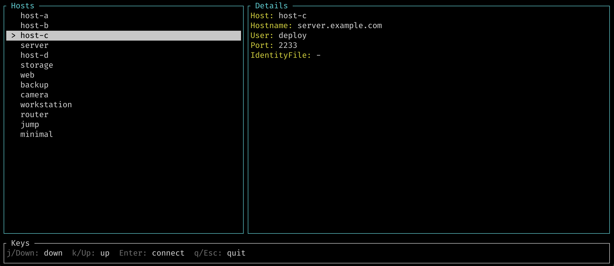

# sshtui

Terminal UI to pick an SSH host from your config and connect. Reads `~/.ssh/config` (or a path you pass), lists connectable hosts with details, and runs `ssh <host>` when you press Enter.



## Install

**Homebrew** (macOS):

```bash
brew tap stoneburner/sshtui
brew install sshtui
```

See [HOMEBREW.md](HOMEBREW.md) for details and how to update the formula when releasing.

## Build

```bash
cargo build --release
```

## Usage

```bash
# Use default config ~/.ssh/config
./target/release/sshtui

# Use a specific config file (e.g. the example in this repo)
./target/release/sshtui --config example_config
```

## Keys

- **j / Down**: move selection down
- **k / Up**: move selection up
- **Enter**: connect to selected host (runs `ssh <host>`)
- **q / Esc**: quit without connecting

## Requirements

- Rust 1.74+
- `ssh` on your PATH

Host blocks that are wildcard-only (e.g. `Host *`) are skipped so only named hosts you can actually connect to are shown.
